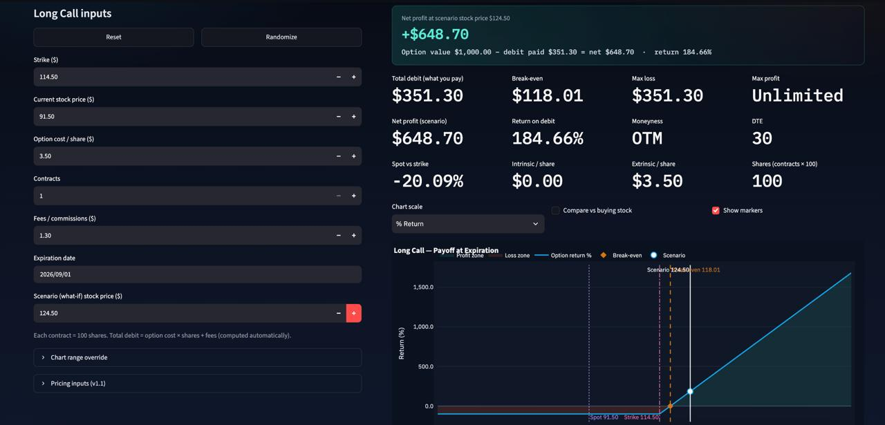
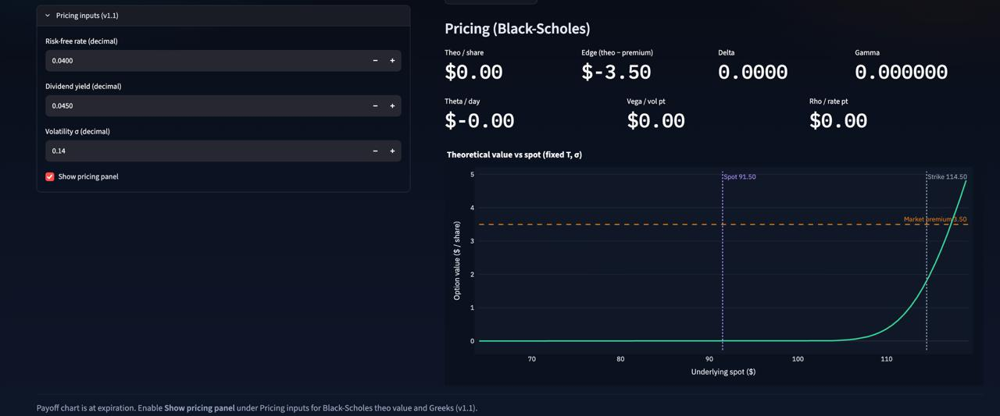

# Options Desk

Interactive long call / long put profit calculator for planning option trades.
Enter strike, spot, premium, contracts, and fees — see break-even, max loss,
dollar/% P/L across a stock-price range, and scrub scenarios on the chart.

## Screenshots





## Setup

With [uv](https://github.com/astral-sh/uv) (recommended):

```bash
uv sync
```

Or with pip:

```bash
python -m venv .venv
source .venv/bin/activate
pip install -r requirements.txt
pip install -e .
```

## Run

```bash
uv run options-app
```

Or:

```bash
uv run streamlit run options_app/app.py
```

Open **http://127.0.0.1:8501** only. The app binds to loopback
(`server.address = 127.0.0.1` in `.streamlit/config.toml`), so it is not
reachable from other devices on your LAN.

## Tests & lint

```bash
uv run pytest
uv run ruff check .
uv run black --check .
```

## Features

**v1 — Expiration payoff**

- Call / Put tabs with independent inputs
- Total debit (premium × shares + fees), break-even, max loss / max profit
- Net profit callout at the scenario stock price
- DTE, moneyness, spot-vs-strike %, intrinsic / extrinsic
- Interactive P/L chart with win/loss shading
- Markers for strike, spot, break-even, and scenario (click chart to set scenario)
- Toggle $ vs % return on the chart
- Compare vs buying the underlying stock
- CSV export of the payoff table

**v1.1 — Black-Scholes**

- Pricing inputs: risk-free rate $r$, dividend yield $q$, volatility $\sigma$ (decimals)
- Optional pricing panel: theo value, edge vs premium, Δ Γ Θ ν ρ
- Theo value vs spot curve at fixed $T$ and $\sigma$

## Docs

- [PLAN.md](PLAN.md) — technical checklist and architecture
- [theory/pricing-inputs-and-greeks.html](theory/pricing-inputs-and-greeks.html) — notes on pricing inputs, Greeks, and chart interpretation (open in a browser)

## Math (expiration)

Long call P/L:

\[
\text{PnL}(S) = \max(S-K,0)\cdot M - D
\quad\text{break-even}=K+D/M
\]

Long put P/L:

\[
\text{PnL}(S) = \max(K-S,0)\cdot M - D
\quad\text{break-even}=K-D/M
\]

where \(M = 100\times\text{contracts}\) and \(D = \text{premium}\cdot M + \text{fees}\).
